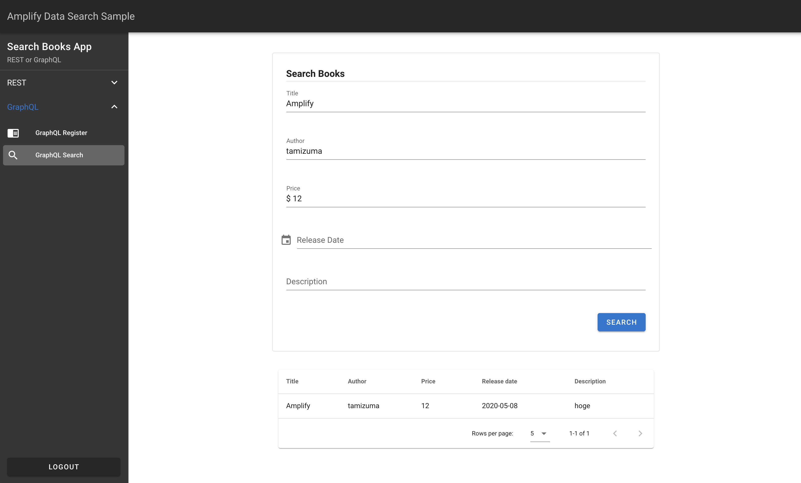

# Amplify Vue 管理画面サンプルプロジェクト

AWS Amplify と Vue.js を用いた管理画面のサンプルプロジェクトです。認証認可の機能と、GraphQL、REST API を用いた書籍情報の管理機能を提供します。



## アーキテクチャ

この管理画面では書籍情報の登録と検索の機能を提供します。書籍情報へのアクセスは [Amazon API Gateway](https://aws.amazon.com/jp/api-gateway/) を用いた REST によるアクセスと、[AWS AppSync](https://aws.amazon.com/jp/appsync/) を用いた GraphQL によるアクセスの２種類のインターフェースが用意されています。


### REST による処理

REST API では、API のインターフェースに Amazon API Gateway、バックエンドの処理には [AWS Lambda](https://aws.amazon.com/jp/lambda/)、データストアには [Amazon DynamoDB](https://aws.amazon.com/jp/dynamodb) が用いられています。

### GraphQL による処理

GraphQL API では、API のインターフェースに AWS AppSync、データストアには DynamoDB と全文検索のための [Amazon Elasticsearch Service](https://aws.amazon.com/jp/elasticsearch-service/) が用いられています。DynamoDB に保存されたデータは DynamoDB Stream の機能により、Lambda を経由して Elasticsearch に同期されます。DynamoDB のパーティションキー、ソートキーによる検索を行う場合は、AppSync は DynamoDB に対してクエリの発行を行います。全文検索を行う場合は、AppSync は Elasticsearch に対してクエリを発行します。

_注意_ REST と GraphQL のデータストアはそれぞれ独立した作りとなっています。例えば、REST で登録したデータは GraphQL で検索することはできません。

## 開始方法

1. Amplify CLI をインストールします

```bash
$ npm install -g @aws-amplify/cli
```

2. Amplify CLI の設定を行う

既にご利用の端末で`amplify configure`を実施済みの場合は、以下のコマンドはスキップしてください。

```bash
$ amplify configure
```

3. プロジェクトのソースを Clone し、必要なパッケージを取得します

```bash
$ git clone git@github.com:aws-amplify-jp/amplify-vue-management-console-example.git
$ cd amplify-vue-management-console-example
$ npm install
```

3. Amplify のバックエンドを構築します。

`amplify init`コマンドでバックエンド構築のための前処理を行います。コマンドラインからいくつか質問をされますが、特に指定がない場合は全てデフォルトの設定を選択します。

```bash
$ amplify init
```

次に`amplify status`コマンドで構築されるバックエンドの情報を確認します。以下のように`Auth`、`Api`、`Storage`、`Function`カテゴリが構築対象に含まれていれば OK です。これらの詳細な情報は`amplify/backend`フォルダ配下の各カテゴリフォルダから確認することができます。

```bash
$ amplify status

Current Environment: dev

| Category | Resource name                | Operation | Provider plugin   |
| -------- | ---------------------------- | --------- | ----------------- |
| Auth     | amplifyvuesearchexam21160aeb | Create    | awscloudformation |
| Api      | booksearchgraphql            | Create    | awscloudformation |
| Api      | booksearchrest               | Create    | awscloudformation |
| Storage  | booksearchrest               | Create    | awscloudformation |
| Function | booksearchrest               | Create    | awscloudformation |
```

`amplify push`コマンドでバックエンドの構築を行います。いくつか質問がなされますが、全てデフォルトの内容で回答します。

```bash
$ amplify push
```

バックエンドの構築には 20 分程度時間がかかります。

Amplify CLI の典型的なワークフローに関しては[公式ドキュメント](https://docs.amplify.aws/cli/start/workflows)を参照してください。

4. アプリケーションを起動します

```bash
$ npm run serve
$ open http://localhost:8080/
```

アプリケーションの利用にはユーザの Sing Up が必要になります。ログイン画面の「Create account」リンクからユーザの登録を行なってください。

## 注意点

このサンプルプロジェクトでは、バックエンドに全文検索エンジンである`Amazon Elasticsearch Service`のインスタンスが起動します。EC2 と同様にインスタンスが起動している時間に対して課金が発生するため、そのままにしておくと不必要なコストが発生してしまいます。検証が終わったら以下コマンドを発行して、バックエンドを全て削除してください。

```bash
$ amplify delete
```

全てのバックエンドを削除しても良いか確認が行われるので`Y`で回答します。

_amplify delete コマンドに関する捕捉_
Amplify CLI では `multiple environments` の機能を用いることで本番環境以外にもステージング環境や開発環境といった複数の環境を複製することができます。`amplify delete`コマンドでは複製した全ての環境を削除する点について注意してください。個別の環境のみを削除したい場合は`amplify env remove ${環境名}`コマンドを実行してください。複数環境を用いたチーム開発のワークフローに関しての詳細は[公式ドキュメント](https://docs.amplify.aws/cli/teams/commands#team-workflows)を参照してください。

```bash
? Are you sure you want to continue? This CANNOT be undone. (This would delete all the environments of the project from the cloud and wipe out all the lo
cal files created by Amplify CLI) (y/N) Y
```

## Security

See [CONTRIBUTING](CONTRIBUTING.md#security-issue-notifications) for more information.

## License

This library is licensed under the MIT-0 License. See the LICENSE file.
